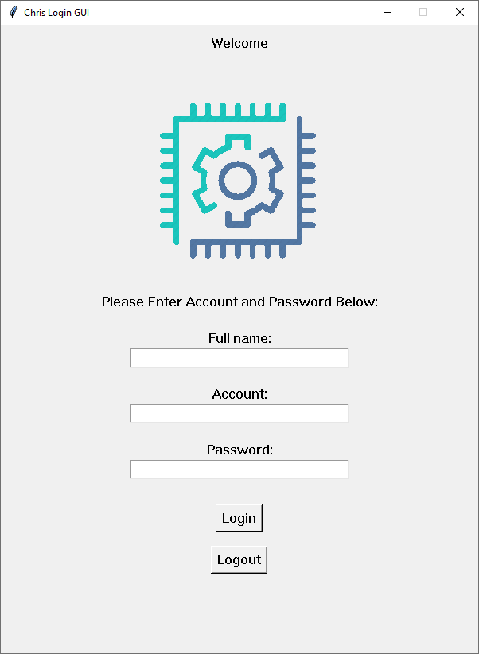

# Example image of how the Login App For Windows 10 looks like

## This app uses Python, the Selenium Webkit, and the Chromium Webdriver version 84 to essentially make a "bot" that logs into a website for a user without having to manually open a browser.

### Current issues

The Chrome webdriver does not see a valid certificate to securely connect sessions to a certain website. Web pages will not be secured when logged into a website.

